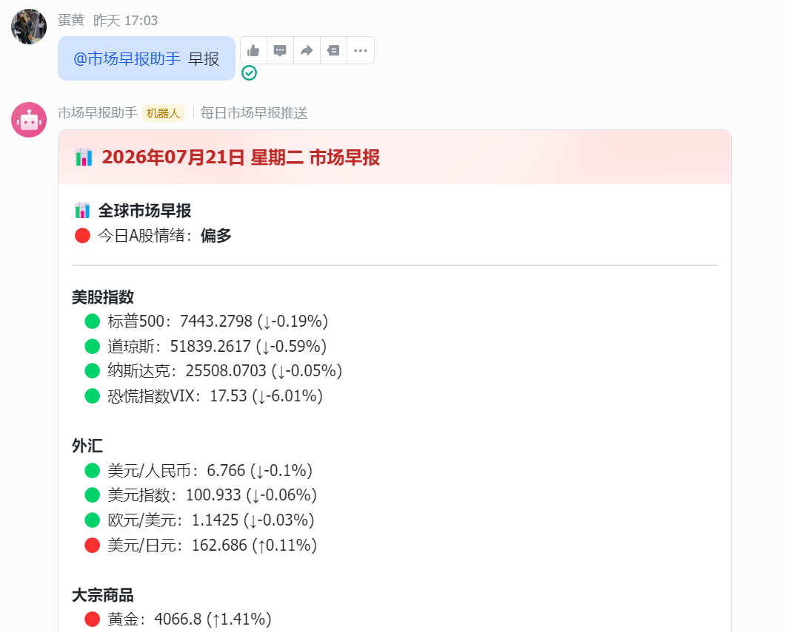
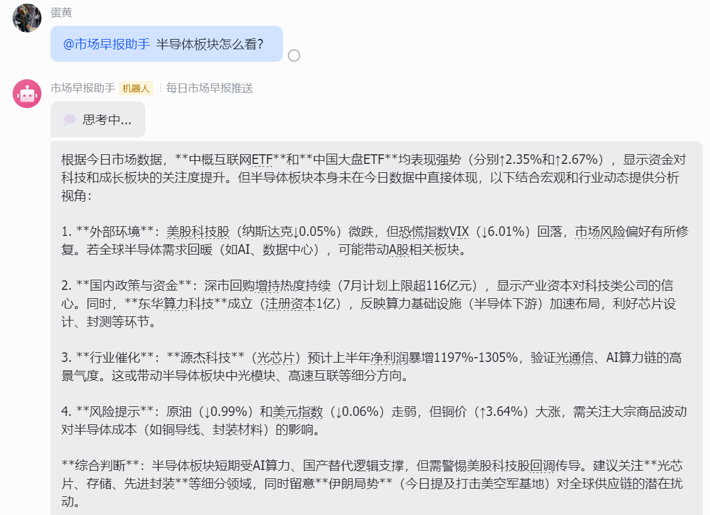
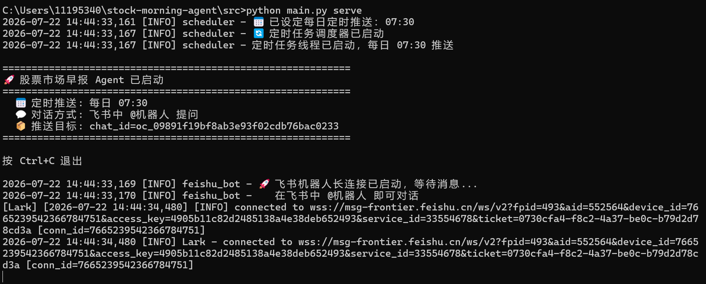

# 🎬 股票国际市场早报 Agent — 效果展示

> 作者：邹尔舒 | 2026年7月

## 一、飞书早报卡片（核心效果）

### 每日早报推送



**说明**：每天早上7:30，机器人自动推送到飞书群的早报卡片，包含：
- 行情速览（15个标的涨跌一目了然）
- AI行情综述（200字市场总结）
- 重要新闻影响分析（每条带影响链路）
- 今日A股综合研判（情绪+走势+板块+操作建议）

### 个性化早报对比

| 维度 | 默认早报 | 个性化早报（你的） |
|------|---------|------------------|
| 新闻筛选 | 均衡覆盖各板块 | 优先筛选AI/半导体相关新闻 |
| 分析深度 | 标准影响链路 | 增加产业链传导分析 |
| 板块建议 | 通用建议 | 聚焦科技成长板块 |
| 风格 | 中性客观 | 成长型、数据驱动 |

## 二、对话交互

### @机器人提问



**说明**：在飞书群 @机器人 即可提问，机器人会基于用户偏好和今日市场数据给出个性化回答。支持：
- 行情解读：今天美股为什么大跌？
- 板块分析：半导体板块今天怎么看？
- 新闻追问：美联储加息对A股有什么影响？

### 快捷指令

- 发送「早报」→ 立即推送今日早报
- 发送「帮助」→ 查看功能列表

## 三、后台运行

### 服务启动



**说明**：本地运行 `python main.py serve` 启动服务，通过飞书长连接（WebSocket）与飞书服务器建立双向通道，无需公网IP和服务器。启动后：
- 定时推送：每日7:30自动生成并推送早报
- 对话监听：实时接收用户@机器人的消息并回复

## 四、个性化配置

### 偏好配置文件示例

```json
{
  "name": "邹尔舒",
  "style": "成长型投资者",
  "focus_sectors": ["AI", "半导体", "新能源", "消费电子", "互联网"],
  "avoid_sectors": ["房地产", "煤炭", "钢铁"],
  "risk_tolerance": "中等偏高",
  "analysis_preference": "关注技术趋势和产业链传导",
  "market_bias": "偏多",
  "custom_notes": "对AI产业链（算力、大模型、应用层）有专业兴趣"
}
```

### 对话记忆

每次@机器人提问会自动记录到SQLite数据库，系统定期分析用户提问模式，自动识别兴趣板块并更新偏好配置。

## 五、作品集展示建议

### 简历中的项目描述

```
股票国际市场早报 Agent | 独立开发 | 2026.07

从0到1设计并开发了一款AI驱动的全球市场早报产品，覆盖美股、外汇、
大宗商品等15个标的。核心创新：
- 基于DeepSeek实现「新闻→影响链路→A股板块」三级研判体系
- 设计用户偏好系统（profile + prompt注入 + 对话记忆）
- 集成飞书长连接，实现定时推送+对话交互的完整闭环
- 日均成本<0.03元，已服务家庭用户

技术栈：Python / DeepSeek / 飞书SDK / yfinance / SQLite
```

### 面试时的讲述框架

**1分钟电梯演讲**：
"我做了一个AI全球市场早报产品。每天早上7:30自动推送到飞书，不是简单的资讯搬运，而是用DeepSeek做三级研判——行情综述、新闻影响链路分析、A股综合研判。每条新闻都会分析事件→传导路径→板块影响的完整链路。我还设计了用户偏好系统，根据投资风格自动调整分析角度。目前我和家人都在用，日均成本不到3分钱。"

**面试官可能的追问和回答**：

| 追问 | 回答要点 |
|------|---------|
| 为什么不做App而选飞书？ | MVP验证核心价值，飞书零成本触达用户 |
| 为什么选DeepSeek？ | 推理能力+中文+价格+国内直连的最优解 |
| 个性化怎么做的？ | 三层架构：偏好配置→Prompt注入→对话记忆 |
| 遇到什么困难？ | 飞书长连接调试（事件订阅/权限/发布版本闭环） |
| 下一步做什么？ | 反馈机制、Web管理后台、多市场扩展 |
